# Diegetic 3D Investigation Design

**Status:** Approved product direction; implementation has not begun
**Date:** July 15, 2026
**Project:** History Unbroken: The Road That Should Have Closed

## Intent

Make the student feel physically present inside the fractured Flight to Varennes while preserving the authored evidence system, historical provenance, accessible reading surfaces, and deterministic authority that make the project educationally defensible.

## Summary

History Unbroken will become a browser-based diegetic hybrid. The player controls a fixed, unnamed, period-dressed timeline investigator in a compact third-person reconstruction of Varennes. Movement, evidence discovery, character encounters, and the final pursuit occur in 3D. Reading-heavy work opens as focused React DOM overlays from physical objects such as documents, archive tables, journals, and evidence boards.

This is not an open-world game. "Red Dead-style" means grounded cinematic presentation, deliberate third-person movement, voiced proximity-based conversations, environmental atmosphere, and an embodied investigation. It does not mean combat, systemic survival, unrestricted riding, a large map, or a simulation of alternate France.

The existing deterministic case engine remains authoritative. The 3D world can request canonical actions but cannot create evidence, unlock findings, alter historical facts, score hypotheses, or repair the timeline independently.

## Locked Product Decisions

| Decision | Locked Direction |
|---|---|
| Delivery | Browser-only, inside the existing Next.js application |
| Player | Fixed unnamed timeline investigator in period clothing |
| World | Temporal reconstruction, not a claim that every station coexisted literally |
| Visual direction | Grounded stylized realism |
| Primary hardware | Typical school Chromebook or ordinary laptop |
| Session length | 10-20 minutes; direct replay near 10-12, first guided play near 15-20 |
| Movement | In the selected 3D mode, short traversal is required for first discovery; journal fast travel follows. A directly selectable non-spatial path remains available. |
| 3D scope | Exploration, NPC encounters, evidence discovery, and pursuit |
| Focused overlay scope | Primer, document reading, source comparison, Case Brief, and debrief |
| World footprint | Four compact connected zones |
| Conversational characters | Drouet and Louis only under current model policy |
| Other historical content | Civic and Assembly reconstructed stations |
| Ambient residents | Scripted movement and one-line remarks; no model calls or required evidence |
| Conversation | Cinematic close-up with typed or push-to-talk input and voiced replies |
| Voice style | Clear modern English with restrained character differences and no performed accent stereotypes |
| Camera | Medium-distance third person; cinematic camera during interactions |
| Atmosphere | Late evening, warm lantern light, cool moonlight, restrained fog |
| Navigation | Subtle compass, proximity prompts, journal map, optional objective guidance |
| Pursuit | Guided playable route with authored checkpoints; no general horse system |
| Assets | Mixed pipeline: licensed packs, modified assets, custom hero work, and generated supporting media |
| Teacher packet | Preserved, but implemented after the first complete 3D vertical slice |

## Experience Flow

### 1. Context Primer

The existing novice-safe 2D primer remains. It teaches only the minimum context required to investigate the case. Before the investigation begins, the student may select the 3D temporal reconstruction or the equivalent non-spatial investigation. The 3D choice transitions into the archive antechamber and establishes the unnamed investigator's mission.

### 2. Archive Antechamber

The archive is the out-of-time hub. The student gains control, learns movement, and approaches a physical briefing table. Interacting with the table moves the camera into a focused overlay while the world remains visible behind it.

The archive contains:

- The context table.
- The case journal.
- The physical causal evidence board.
- The Assembly reaction installation.
- A return point used for the Case Brief and debrief.

### 3. Open Investigation

The player moves through four compact connected zones:

1. **Archive antechamber:** primer, journal, caseboard, Assembly reaction, final report.
2. **Post-road square:** Drouet encounter, route evidence, post-road context.
3. **Royal lodging and civic area:** Louis encounter, declaration, civic response reconstruction.
4. **Bridge approach:** geographic chokepoint, altered branch observation, repair destination.

The route between zones should establish atmosphere without wasting classroom time. A first visit requires walking. Once discovered, the location appears in the journal map and supports fast travel.

### 4. Character Encounters

Approaching Drouet or Louis opens a cinematic conversation state:

- Movement input is suspended.
- The camera frames the NPC and investigator.
- The player types a question or holds a push-to-talk control.
- The player may present only evidence authorized for that station.
- The validated response appears as synchronized text and generated audio.
- Replay, mute, skip-audio, and text-only controls remain available.

Generated dialogue is always labeled as dramatized and non-evidentiary. Only reviewed evidence can satisfy case requirements.

### 5. Physical Evidence And Focus Views

Evidence is discovered through world objects. Interacting with a document, station, map, or board opens a focused React DOM overlay. The overlay retains the existing provenance badge, source metadata, simplified/original toggle, and accessibility behavior.

The student does not read long text rendered into a 3D texture. The 3D object establishes an interaction topic and provenance category; it does not independently establish historical ownership, exact placement, or source authenticity. The DOM overlay performs the educational reading task and carries the authoritative evidence metadata.

### 6. Case Brief

The student returns to the archive evidence board. The physical board reflects inspected and pinned evidence. Interacting with it transitions to the existing causal-board and Case Brief interface.

GPT-5.6 remains formative. The deterministic system retains hard-gate authority. Repair unlocks only when the current bounded assessment rules pass.

### 7. Guided Pursuit And Repair

The repair becomes a short playable route reconstruction:

- The player controls direction and speed within an authored path.
- Evidence-backed route checkpoints appear in the supported sequence.
- Incorrect branches visibly conflict with the established evidence.
- No combat, failure timer, open riding, or speculative alternate outcome is introduced.
- Reaching Varennes restores the warning, then shows local mobilization enabling blocked onward passage and passport inspection as parallel actions. Those actions together enable guarded collective detention; neither action is depicted as the sole arrest mechanism.

The pursuit is a reconstruction of the causal mechanism, not proof that Drouet alone determined later history.

### 8. Debrief

The player returns to the archive desk. A physical report opens the existing accessible debrief and teacher-report surfaces. The report distinguishes observed student behavior, deterministic results, and AI-assisted narrative feedback.

## Architecture Decision

### Selected: React Three Fiber Inside The Existing Next.js App

Use:

- `three`
- `@react-three/fiber` v9-compatible releases for React 19
- `@react-three/drei`
- `@react-three/rapier` v2-compatible releases
- `ecctrl`
- glTF 2.0 assets

React Three Fiber is a React renderer for Three.js and integrates directly with the existing React state model. React Three Rapier provides the physics boundary, and Ecctrl supplies a maintained character-controller and animation-state foundation.

Primary references:

- [React Three Fiber introduction](https://r3f.docs.pmnd.rs/)
- [React Three Fiber installation and Next.js guidance](https://r3f.docs.pmnd.rs/getting-started/installation)
- [React Three Fiber performance guidance](https://r3f.docs.pmnd.rs/advanced/scaling-performance)
- [React Three Rapier](https://pmndrs.github.io/react-three-rapier/)
- [Ecctrl](https://github.com/pmndrs/ecctrl)
- [Three.js GLTFLoader](https://threejs.org/docs/pages/GLTFLoader.html)

### Rejected: Babylon.js

Babylon.js is a capable browser engine, but it would introduce a separate engine loop and a custom React-to-engine state adapter. That boundary provides limited value for this project because the existing educational state, UI, and AI integration are already React-native.

### Rejected: Unity WebGL

Unity would provide a visual editor and broad asset tooling, but it would also introduce a separate C# runtime, JavaScript bridge, build pipeline, test surface, and larger browser delivery boundary. The existing deterministic engine and accessible overlays would become external systems rather than first-class application components.

## System Boundaries

### Deterministic Case State

`CaseSessionProvider` remains the only authority over:

- Inspected evidence.
- Pinned evidence.
- Recorded findings.
- Causal-board state.
- Hypothesis requirements.
- Repair eligibility.
- Repair progression.
- Debrief telemetry.

### Spatial Runtime State

The 3D runtime owns only ephemeral spatial concerns:

- Investigator transform and movement state.
- Camera mode and target.
- Nearby interactable.
- Current zone.
- Discovered fast-travel locations.
- Animation state.
- Current cinematic or focus-view mode.
- Adaptive graphics tier.

Spatial state cannot independently mutate educational state.

### Interaction Adapter

Every interactable uses a stable canonical ID from an authored scene manifest. The 3D world emits requests such as:

```text
inspect_evidence(E3)
present_evidence(DROUET, E3)
open_station(CIVIC_RESPONSE)
open_caseboard()
enter_repair_checkpoint(ROUTE_CORRECTION)
```

The deterministic case engine validates each request and returns the permitted transition. Unknown IDs or unauthorized actions fail closed.

### Scene Manifest

The world is data-driven through a reviewed manifest containing:

- Zone IDs and spawn points.
- Interactable IDs and canonical target IDs.
- Interaction type.
- Prerequisites.
- Focus-overlay route or component key.
- Provenance category.
- Related fact, source, and evidence IDs when the placement implies a historical claim.
- Placement status and reconstruction-confidence level.
- Explicit location, ownership, scale, and appearance limitations.
- Fast-travel unlock behavior.
- Ambient line IDs.
- Repair checkpoint IDs.
- Asset and license references.

The manifest cannot define new historical facts or evidence. Geometry and placement cannot become assessed evidence; they may only route the player to canonical records already authorized by the case package.

## Voice Architecture

### Selected Pipeline

```mermaid
flowchart LR
  Player["Typed or push-to-talk question"] --> Transcription["Speech transcription when needed"]
  Transcription --> ExistingTurn["Existing GPT-5.6 character-turn service"]
  ExistingTurn --> Authorization["Server ID and policy authorization"]
  Authorization --> Caption["Authorized spoken_response text"]
  Caption --> Speech["Text-to-speech generation"]
  Speech --> Playback["Audio playback plus exact caption"]
```



Push-to-talk records only after an explicit player action. The browser sends a bounded audio blob to a server transcription endpoint. The resulting transcript enters the same character-turn service as typed input. The application authorizes model IDs and renders the final spoken text from authored policy. Text-to-speech receives that exact final text.

This staged design is preferred over unconstrained speech-to-speech because historical authorization occurs before any audio is produced.

Initial model direction, subject to implementation-time verification:

- Transcription: `gpt-4o-transcribe` or a lower-cost approved transcription model.
- Historical response: existing `gpt-5.6` structured character-turn path.
- Speech: `tts-1` for latency, with evaluation against an approved quality option.

Official references:

- [GPT-4o Transcribe](https://developers.openai.com/api/docs/models/gpt-4o-transcribe)
- [TTS-1](https://developers.openai.com/api/docs/models/tts-1)
- [MediaRecorder API](https://developer.mozilla.org/en-US/docs/Web/API/MediaRecorder)

### Required Versioned Media Contracts

Before voice implementation, `docs/AI_CONTRACTS.md` must add two explicit media-transform contracts. They are not permitted to enter production as informal exceptions to the existing ID-only model rules.

**Contract F: player transcription**

- Input: `contractVersion`, `caseId`, `stationId`, `requestId`, `stateRevision`, MIME type, bounded duration, and a bounded audio blob.
- Initial bounds: one channel, at most 20 seconds, at most 2 MB, and no client-supplied filename or path authority.
- Output: the same correlation metadata, a transcript capped at the existing 600-character character-turn limit, detected duration, and a success or classified-failure status.
- The transcript is treated as untrusted player input, not a historical model plan or source.
- The browser displays or submits the result only while `requestId`, `stateRevision`, station, and presented evidence still match the active interaction.
- Abort and stale-response behavior must match the existing character-turn service.
- Provider retries are disabled; the service may perform at most one explicit retry for the existing classified transient-failure set.
- Raw audio and full transcripts are excluded from application logs. Temporary audio bytes are released immediately after transcription completes or fails.
- The follow-on character turn retains `store: false`, moderation, strict structured output, ID-only authorization, and formative-only authority.

**Contract G: authorized speech synthesis**

- Input: correlated request metadata, the final server-rendered `spokenResponse`, and a short-lived server-signed speech ticket containing a hash of that exact text, station, request, state revision, voice ID, and expiry.
- The speech endpoint verifies the signature, expiry, correlation fields, and text hash before calling the provider. Arbitrary client text cannot be synthesized through this route.
- Output: audio plus the same correlation metadata and a hash of the synthesized text. It returns no new historical text, fact ID, evidence ID, score, or state transition.
- The browser plays audio only when the returned correlation metadata still matches the visible caption and active turn.
- Provider retries, timeout, rate limiting, cancellation, and error classification follow the existing operational boundary.
- Generated audio is not persisted by the application. Only approved authored fallback clips may be cached.

Both contracts remain non-authoritative media transforms. Neither may unlock evidence, add claims, affect scoring, or mutate case state. The contract tests must prove byte cleanup, stale-response rejection, exact text-hash identity, and no logging of raw audio or transcripts.

### Voice Safety And Accessibility

- Never request microphone permission before the player presses the talk control.
- Enforce the Contract F duration and payload limits in both browser and server code.
- Moderate the transcript through the existing safety boundary.
- Do not retain raw audio or log raw transcript content after the request completes.
- Do not create or clone a real person's voice.
- Use clear modern English rather than caricatured accents.
- Display an AI-voice disclosure.
- Keep captions visible and authoritative.
- Provide typing, mute, replay, skip, and text-only completion.
- Cache only non-sensitive authored fallback audio where permitted.

## Component Architecture

Proposed module boundaries:

```text
app/play/world/
components/world/
  world-canvas.tsx
  world-shell.tsx
  scene-runtime.tsx
  interaction-adapter.tsx
  focus-overlay-host.tsx
components/world/character/
  investigator-controller.tsx
  investigator-model.tsx
  animation-controller.tsx
  follow-camera.tsx
components/world/zones/
  archive-zone.tsx
  post-road-zone.tsx
  civic-zone.tsx
  bridge-zone.tsx
components/world/interactions/
  interactable.tsx
  evidence-interactable.tsx
  character-interactable.tsx
  station-interactable.tsx
components/world/dialogue/
  cinematic-conversation.tsx
  push-to-talk-control.tsx
  voiced-response.tsx
components/world/repair/
  pursuit-runtime.tsx
  route-checkpoint.tsx
lib/world/
  scene-manifest.ts
  interaction-policy.ts
  graphics-profile.ts
  spatial-session.ts
lib/audio/
  recorder.ts
  playback.ts
  voice-types.ts
app/api/ai/transcribe/
app/api/ai/speech/
data/cases/varennes/world/
  scene-manifest.json
  ambient-lines.json
  asset-ledger.json
```

The exact names may change to match implementation discoveries, but the boundaries must remain: rendering, movement, interactions, educational state, and model authorization cannot collapse into one component.

## Asset Pipeline

### Sources

Use a mixed pipeline:

1. Curated licensed environment, prop, character, and animation assets.
2. Material, texture, proportion, and topology changes for consistency.
3. Custom hero assets for historically specific evidence and landmarks.
4. Generated portraits, textures, and supporting bitmap media where suitable.
5. Paid assets only after explicit approval.

### Required Ledger Fields

Every shipped asset records:

- Asset ID.
- Source URL or creator.
- License and proof of license.
- Original file name.
- Modifications.
- Historical or fictional status.
- In-game use.
- Related fact, source, and evidence IDs, when any historical claim is implied.
- Placement status: `documented`, `approximate_reconstruction`, `schematic_temporal_reconstruction`, or `fictional_fracture`.
- Reconstruction confidence and the specific location, ownership, scale, or appearance limitations.
- Whether interacting with the asset opens a countable evidence record; the asset itself is never countable evidence.
- Compression output.
- Attribution requirement.

Environment geometry, prop placement, lighting, clothing, and ambient animation cannot independently satisfy an assessment gate. A world object may open a reviewed evidence overlay, but only that canonical evidence record carries facts and provenance into scoring. Exact layout and object ownership remain unclaimed unless the case canon and source ledger explicitly authorize them.

### Runtime Format

- Prefer glTF/GLB.
- Compress geometry with Draco or Meshopt when it improves total delivery cost.
- Use KTX2/Basis textures where supported by the asset pipeline.
- Reuse materials and geometries.
- Instance repeated props.
- Use simplified authored colliders rather than detailed render meshes.

## Performance Design

### Primary Target

- Physical target: a current stable ChromeOS browser on a 4 GB integrated-graphics Chromebook in the Intel Celeron N4500 performance class or a documented equivalent.
- Automated proxy: Chromium at 1366 x 768, 4x CPU slowdown, Fast 4G network profile, and the lowest supported graphics tier.
- After a 10-second warm-up, a scripted 60-second archive-to-bridge traversal must maintain median FPS at or above 30 and 10th-percentile FPS at or above 24, with no post-load stall longer than 250 ms.
- The archive must become interactive within 8 seconds under the automated Fast 4G profile, excluding an uncached provider API call.
- The initial archive transfer budget is 15 MB compressed. The complete progressively loaded district budget is 35 MB compressed. A budget exception requires a written measurement and approval.
- No dependency on dedicated graphics hardware.
- Quality degradation must preserve readability and interaction.

### Adaptive Quality

Graphics profiles may adjust:

- Device pixel ratio.
- Shadow resolution or shadow availability.
- Fog density and distance.
- Post-processing availability.
- Ambient resident count.
- Prop density.
- Texture resolution.
- Level-of-detail thresholds.

The application should monitor sustained performance and step quality down without changing game logic. If rolling average FPS remains below 28 for three seconds, it moves down one graphics tier. If the lowest tier remains below 24 for five seconds, it offers the directly selectable non-spatial investigation path.

The physical Chromebook gate and automated proxy are both required before release. The proxy catches regressions; it is not accepted as proof of physical-device performance.

### Loading

- Load the archive and minimum investigator assets first.
- Stream district zones and higher-resolution assets progressively.
- Display an authored low-detail fallback while optional assets load.
- Do not block the primer on the complete district bundle.
- Preserve progress across a page refresh.

### Hard Gate

Do not expand beyond the first zone until the graybox vertical slice meets movement, camera, interaction, overlay, nonblank-canvas, initial-transfer, interactivity-time, and scripted 60-second performance checks.

The 10-20 minute learning target is measured separately: the automated direct path must complete in at most 12 minutes without provider latency, and at least three first-time external playtesters must produce a median completion time at or below 20 minutes with no non-optional run above 25 minutes. Optional wandering time is reported separately.

## Accessibility

- The primer offers the complete non-spatial investigation directly. A student never has to fail a WebGL probe or disclose an accessibility need to use it.
- The non-spatial route provides equivalent evidence discovery, character content, source comparison, Case Brief requirements, repair meaning, debrief, and teacher telemetry.
- No precision platforming, combat, reflex gate, or timed decision.
- Keyboard remapping and clear focus management.
- Captions enabled by default.
- Text alternatives for all spoken content.
- Reduced motion disables cinematic camera sweeps and replaces the pursuit with a stepped route sequence.
- The focused DOM overlays remain keyboard and screen-reader accessible.
- Discovered-location fast travel reduces repeated traversal.
- Navigation guidance can be increased without changing historical requirements.
- If WebGL is unsupported or repeatedly fails, recommend the same directly selectable non-spatial experience without losing progress.

The canvas itself is not treated as the only accessible representation of evidence or assessment.

## Error Handling And Fallbacks

| Failure | Required Behavior |
|---|---|
| WebGL unavailable | Offer the current complete 2D investigation |
| Asset load failure | Use placeholder geometry and preserve interactable IDs |
| Low sustained frame rate | Reduce quality and ambient density; offer 2D mode if unresolved |
| Microphone denied | Keep typed input and explain the local permission state briefly |
| Transcription failure | Preserve recording only until retry decision; allow typed correction |
| GPT failure | Use authored bounded character fallback |
| Speech failure | Show authorized caption and allow text-only continuation |
| Audio autoplay blocked | Begin playback only after explicit interaction |
| Scene manifest mismatch | Fail closed and log the invalid ID; never invent a mapping |
| Progress restore mismatch | Preserve deterministic case state and return to a safe zone spawn |

## Testing Strategy

### Unit Tests

- Scene-manifest schema validation.
- Canonical ID existence.
- Interaction request authorization.
- Fast-travel unlock rules.
- Zone and spawn restoration.
- Graphics-profile selection.
- Voice state machine.
- Recording size and duration bounds.
- Exact caption-to-speech text identity.
- Signed speech-ticket verification, expiry, and tamper rejection.
- Transcription and speech correlation, abort, and stale-response rejection.
- Raw-audio cleanup and log-redaction behavior.
- Pursuit checkpoint order, including parallel blocked-passage and passport-inspection actions before guarded detention.
- Reduced-motion pursuit alternative.

### Integration Tests

- 3D interaction dispatches into the existing case reducer.
- Unauthorized evidence remains unavailable in conversation.
- Journal focus views pause movement and restore it safely.
- Dialogue camera mode cannot mutate case state.
- Transcription enters the same moderation and authorization path as typed text.
- Teacher alignment cannot alter world canon after it is introduced.

### End-To-End Tests

- Primer to world entry.
- Investigator movement and camera.
- Evidence discovery and overlay opening.
- Drouet typed conversation.
- Drouet push-to-talk conversation with mocked transcription and speech.
- Louis evidence restrictions.
- Ambient NPCs never unlock findings.
- Journal fast travel after discovery.
- Case Brief submission.
- Guided pursuit and repair.
- Debrief completion.
- API failure fallback.
- WebGL failure fallback.
- Keyboard-only and reduced-motion paths.
- Screen-reader completion of the non-spatial route from primer through debrief.
- Equivalence checks proving that 3D and non-spatial paths expose the same required evidence, findings, hypothesis gates, and repair meaning.

### Visual And Canvas Verification

Before release, capture and inspect desktop and school-laptop viewports for:

- Nonblank canvas pixel output.
- Correct camera framing.
- Investigator visibility.
- Asset presence.
- Overlay legibility.
- No incoherent overlap.
- No horizontal overflow.
- Movement actually changes the rendered frame.
- Pursuit animation actually advances.
- Console and WebGL errors.

## Implementation Sequence

### Phase 0: Technical Spike

- Add the 3D dependencies behind an isolated route.
- Render a nonblank test scene.
- Establish quality detection and error boundary.
- Prove Next.js production build compatibility.

### Phase 1: Graybox Vertical Slice

- One archive zone.
- Fixed investigator placeholder model.
- Ecctrl movement and medium follow camera.
- Simple colliders and one interactable table.
- One focused evidence overlay.
- Case-state interaction adapter.
- Desktop and school-laptop performance gate.

### Phase 2: One Complete Gameplay Loop

- Archive to post-road travel.
- Drouet encounter.
- One evidence discovery.
- Evidence presentation.
- Caseboard return.
- Minimal repair checkpoint.
- Existing fallback retained.

### Phase 3: Complete District

- Four connected zones.
- Fast travel after discovery.
- Louis encounter.
- Civic and Assembly stations.
- Ambient resident paths and authored remarks.
- Complete evidence placement.

### Phase 4: Voice

- Add and review versioned transcription and authorized-speech contracts in `docs/AI_CONTRACTS.md` before calling either provider endpoint.
- Push-to-talk recording.
- Transcription endpoint.
- Existing GPT-5.6 character path.
- Speech endpoint.
- Captions, playback controls, and audio fallback.

### Phase 5: Pursuit And Repair

- Guided route controller.
- Evidence-backed checkpoints for route correction, timely arrival, and warning.
- Local mobilization enables blocked onward passage and passport inspection as parallel actions.
- The combined local actions lead to guarded collective detention; neither passport inspection nor the barrier becomes a lone arrest mechanism.
- Reduced-motion alternative.
- Restored warning and canon-consistent collective response sequence.

### Phase 6: Art And Performance

- Final asset selection and ledger.
- Character and NPC animation.
- Late-evening lighting.
- Lanterns, moonlight, fog, soundscape.
- Adaptive quality, LOD, instancing, and compression.

### Phase 7: Teacher Alignment

- Course packet processing.
- Objective mapping.
- Vocabulary alignment inside focused overlays and debrief.
- Conflict surfacing without changing world canon.

### Phase 8: Hardening And Submission

- Full eval and E2E suite.
- Browser and device matrix.
- Historical-integrity re-review.
- Accessibility review.
- Production deployment.
- Demo recording.

## Parallel Work Boundaries

Parallel agents may work independently on:

- Scene manifest and schemas.
- Character controller and camera spike.
- Asset research and license ledger.
- Voice API contracts and mocks.
- Focus-overlay host and accessibility.
- Visual and E2E test harness.

They must not independently alter:

- Historical fact IDs.
- Evidence content.
- Character knowledge policies.
- Hypothesis hard gates.
- Provenance labels.
- Repair meaning.

The main integrator owns shared case-state contracts and dependency versions.

## Explicit Non-Goals

- Open-world France.
- Combat, weapons, stealth, survival, or morality systems.
- General horse riding.
- Procedural NPC dialogue for ambient residents.
- Four unconstrained historical chatbots.
- Dynamic alternate-history simulation.
- Photorealism.
- Full avatar customization.
- Mobile-first 3D controls.
- Required microphone use.
- Replacing readable DOM interfaces with 3D text.
- Replacing the deterministic case engine.

## Major Risks And Controls

| Risk | Control |
|---|---|
| 3D consumes the product and the educational loop becomes secondary | Vertical slice must include evidence, conversation, caseboard, and repair, not movement alone |
| Browser performance excludes classroom hardware | Graybox gate, adaptive quality, progressive loading, simple colliders, complete 2D fallback |
| The world implies false simultaneity | Permanent temporal-reconstruction disclosure and provenance labels |
| Ambient NPC remarks become mistaken for evidence | Authored lines, no canonical claims, no pinning or progression effect |
| Voice bypasses model authorization | Transcribe first, authorize the text response, synthesize only the authorized caption |
| Asset licenses are unclear | Asset ledger required before integration |
| Paid or free packs look visually inconsistent | Shared materials, palette, texture treatment, lighting, and hero-asset replacement |
| Pursuit overstates Drouet's causal importance | Checkpoints include local action and the final debrief repeats the multicausal limit |
| Two interfaces diverge | DOM overlays reuse existing components and the case reducer remains singular |

## Definition Of Done

The 3D pivot is complete only when:

- The automated direct path completes in at most 12 minutes without provider latency, and at least three first-time external playtesters produce a median completion time at or below 20 minutes with no non-optional run above 25 minutes.
- The student controls a visible investigator through four compact zones.
- Movement is required for first discovery inside 3D mode but does not waste investigation time.
- A directly selectable non-spatial route remains information- and assessment-equivalent from primer through debrief.
- Drouet and Louis respond dynamically within current evidence and knowledge boundaries.
- Typed and push-to-talk questions both work.
- Every generated reply has exact captions and optional audio.
- Ambient residents remain scripted and non-evidentiary.
- Every required document and assessment remains available through accessible DOM content.
- The physical board opens the authoritative Case Brief flow.
- The guided pursuit reconstructs route correction, warning, collective mobilization, blocked passage, passport inspection, and guarded detention without making the barrier or Drouet a lone arrest mechanism.
- The deterministic engine remains the sole authority for evidence, scoring, and repair.
- The case completes when WebGL, microphone, GPT, transcription, or speech generation fails.
- The physical Chromebook and automated proxy both pass the specified frame, stall, transfer, and interactivity budgets, or the 3D path does not ship as the default.
- Desktop and school-laptop screenshots and canvas-pixel checks prove the scene is nonblank, framed, and moving.
- Automated deterministic, integration, model-eval, and end-to-end tests pass.
- Asset licenses, historical statuses, fact/source relationships, placement statuses, and reconstruction limitations are documented.
- Historical-integrity review approves the world, dialogue boundaries, evidence placement, and repair sequence.
