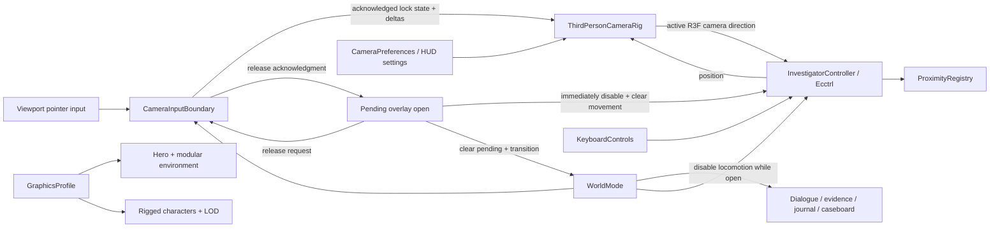

# World Camera and Historical Realism Design

## Status

Approved by the project owner on July 17, 2026.

## Intent

Make the spatial investigation feel like a deliberate third-person game, with camera-relative movement and a historically grounded world that no longer reads as a blocky prototype, while preserving historical clarity, accessibility, and classroom-device performance.

## Context

The current world uses a fixed world-space follow-camera offset. Keyboard input is sent directly to the character controller, so WASD remains aligned to the level rather than the player's view. The world also relies on procedural capsule-and-box figures, repeated box facades, sparse street dressing, one principal road material, and basic lighting. The result is functional but visually toy-like.

The approved direction is **grounded historical realism**: photoreal material, light, scale, and anatomy cues combined with an art-directed historical look. It is not a promise of an exact photogrammetric reconstruction of Varennes, and it is not an attempt to build an AAA open world.

## Goals

1. Mouse movement controls the player's view in a familiar third-person model.
2. WASD movement is relative to camera yaw.
3. Dialogue, evidence, maps, and reasoning overlays remain ergonomic and never trap the cursor.
4. Principal characters have realistic proportions, period-readable clothing, and skeletal animation.
5. The archive lane and bridge-approach chokepoint become visually convincing hero environments without depicting the bridge itself.
6. Buildings, roads, props, and lighting use physically coherent materials and scale cues.
7. High, Balanced, and Classroom profiles preserve one authored experience across different rendering budgets.
8. Visual reconstruction remains clearly distinguished from verified historical evidence.

## Non-Goals

- First-person mode.
- Combat, mounted travel, or an open-world simulation.
- A seamless reconstruction of the entire historical journey.
- A definitive claim that the rendered town geometry exactly matches Varennes in June 1791.
- Unique photoreal assets for every background building or ambient resident.
- Facial performance capture or full lip synchronization.
- Replacing the non-spatial investigation route.
- Making post-processing responsible for visual quality that should come from geometry, materials, composition, and lighting.

## Chosen Approach

### Camera interaction

The world uses **click-to-capture third-person mouse look**.

- Clicking the unobstructed 3D viewport requests pointer lock. User-facing copy may call this "capturing the cursor," but implementation and test names use the browser term `pointer lock`.
- Mouse movement controls unrestricted yaw and a clamped pitch.
- `Escape`, window blur, document visibility loss, route changes, and every investigation overlay release pointer lock.
- Opening dialogue, an evidence inspector, the journal, the caseboard, settings, or an unavailable/error state pauses locomotion and releases the cursor before the overlay receives focus.
- Closing an overlay returns to exploration with the cursor free. The player clicks the world to resume mouse look; the application does not recapture the pointer without a new user gesture.
- A small first-use prompt communicates the capture action and disappears after successful use.
- Browsers without pointer-lock support retain the current keyboard-accessible world and expose a hold-right-mouse orbit fallback.
- Window blur and document visibility loss both suspend `WorldMode`, clear keyboard movement flags, stop horizontal velocity, and release pointer lock. Merely losing pointer lock while the document remains active clears look deltas but does not suspend the world or change velocity; normal keyup and locomotion-disable behavior remain authoritative.
- The first-use prompt is stored in `CameraPreferences` only after the first successful pointer lock, so it remains available after a denial and stays dismissed across reloads. The right-mouse fallback suppresses the browser context menu only while a drag begins and remains inside the world canvas.

`CameraInputBoundary` is the sole owner of pointer-lock state. It observes `document.pointerLockElement` and `pointerlockchange`, requests and exits pointer lock, and publishes the acknowledged state to the rig and HUD. `ThirdPersonCameraRig` consumes the acknowledged state and mouse deltas but never reads or changes browser pointer-lock state directly.

Overlay opening uses an explicit pending-open interlock and release handshake. When an interaction is accepted, `WorldShell` immediately records a `pendingOverlayOpen`, disables locomotion, clears held movement, and stops horizontal velocity while leaving the current `WorldMode` unchanged. It then requests release from `CameraInputBoundary`; the boundary calls `document.exitPointerLock()` when needed and acknowledges after `pointerlockchange` confirms the canvas is no longer locked. Only then does the world atomically clear `pendingOverlayOpen`, enter the focused/cinematic mode, mount the overlay, and move DOM focus.

If the browser never emits the event, a bounded 250 ms timeout checks `document.pointerLockElement` directly and continues only when it is no longer the canvas. If the canvas is still locked, the pending open is cancelled, locomotion becomes eligible again, movement remains cleared until fresh keydown, and the HUD exposes a retry message. The HUD reads the same acknowledged lock and pending-open state, so it cannot report stale status.

Suspension tracks window focus and document visibility separately. The first loss suspends the current `WorldMode`, clears held movement, and records its existing `resumeMode`. The application resumes that stored mode only when `document.visibilityState === "visible"` and `document.hasFocus()` are both true. Resume never restores cleared key state or pointer lock; fresh keyboard and pointer gestures are required.

Camera defaults:

- Shoulder-height third-person framing.
- Full 360-degree yaw.
- Pitch limited to a comfortable range that prevents looking directly under the ground or over-rotating above the character.
- Limited wheel zoom within authored minimum and maximum distances.
- Damped camera movement when reduced motion is off.
- Immediate or strongly reduced damping when reduced motion is on.
- Collision-aware camera distance so walls and facades cannot sit between the player and camera.
- Camera composition keeps the investigator readable without covering nearby interaction targets.

Exact sensitivity, pitch, zoom, and collision values are tuning constants rather than case data. They must be isolated in a focused camera configuration module and covered by range tests.

### Camera-relative locomotion

Ecctrl 2.0 already interprets its directional movement flags relative to the active React Three Fiber camera. The implementation keeps the existing `MovementInput` flags and uses Ecctrl's native camera-relative path with `useCustomForward={false}`. It must not rotate movement a second time and must not send a pre-rotated world-space vector through the directional flags.

Ecctrl obtains the camera's world direction, projects it against the controller's reference up axis, derives the horizontal right vector, combines the directional flags, and normalizes the result. Moving the third-person camera therefore changes the basis for W/S and A/D without replacing Ecctrl's physics logic. Camera pitch does not change horizontal walking speed.

The visible investigator follows Ecctrl's existing movement direction and turn quaternion. Existing walk, run, collision, safe-spawn, proximity, diagonal normalization, and no-jump behavior remain intact. Locomotion remains disabled whenever `WorldMode` is not `exploring` or an accepted overlay interaction is in the pending-open handshake. `useCustomForward` and `setForwardDir` are reserved for a future nonstandard gravity or camera mode and are out of scope here.

## Component Boundaries

### `ThirdPersonCameraRig`

Owns yaw, pitch, zoom, damping, target composition, and camera collision. It consumes pointer-lock state and deltas from `CameraInputBoundary`. The active React Three Fiber camera becomes Ecctrl's native movement reference; the rig does not own browser pointer lock and does not emit or apply a second locomotion transform.

### `CameraInputBoundary`

Solely owns DOM/browser pointer-lock state. It decides when the viewport may request pointer lock, handles fallback orbit input, performs the release handshake for mode changes, and exposes acknowledged lock status to the rig and HUD. It never opens investigation content or changes case state.

### `CameraPreferences`

Owns camera sensitivity, invert-Y, and first-use onboarding state independently of case progress. It uses a strict versioned local-storage envelope at `history-unbroken:world-camera-preferences` with version `1.0.0`, defaults of sensitivity `1.0`, invert-Y `false`, and `pointerLockIntroduced: false`, plus bounded numeric validation. Invalid JSON, unknown properties, unsupported versions, or out-of-range values are discarded to defaults. There is no migration path for version `1.0.0`; a future schema change must add an explicit migration or reset reason. The existing spatial-session envelope is unchanged.

The world settings/HUD control reads and writes this preference service. `ThirdPersonCameraRig` receives validated preferences and never accesses storage directly.

### `InvestigatorController`

Continues to own Ecctrl integration, physical velocity, movement enablement, and locomotion animation state. It sends the existing directional flags to Ecctrl and relies on Ecctrl's active-camera movement basis.

### `WorldVisualProfile`

Extends the existing graphics profile with explicit environment density, character level of detail, shadow/contact treatment, and post-processing permissions. Content selection remains deterministic and does not alter evidence, proximity, or gameplay reachability.

### `HeroEnvironment`

Owns the detailed archive lane and bridge-approach chokepoint assemblies. The latter may show the approach, onward-passage constraint, and authored obstruction interface, but it must not render a bridge span or imply that a bridge object physically arrested the carriage. Connector roads retain optimized modular buildings. Hero assemblies may use shared modules, but they include authored silhouettes, window and door depth, signs, roof variation, street edges, and localized dressing.

### `PeriodCharacter`

Loads rigged period-character assets, maps `idle`, `walk`, and `run` to skeletal clips, accepts `talk` and `interact` as compatibility aliases for idle in this scope, and provides a deterministic lower-detail fallback when an asset fails or the Classroom profile requests it.

## Visual Direction

### Characters

- Replace visible procedural capsule-and-box bodies for the unnamed investigator, Jean-Baptiste Drouet, and Louis XVI. These are the three full 3D character roles currently rendered by the approved scene: one player figure and the two proximity-eligible generated dialogue stations.
- Use realistic human proportions and readable late-eighteenth-century silhouettes.
- Clothing should communicate social role without turning characters into costume caricatures.
- Required component input remains `idle`, `walk`, `run`, `talk`, and `interact`. Rigged assets must provide idle, walk, and run skeletal clips; turn uses the controller's damped root rotation. In this upgrade, only the investigator's `idle`, `walk`, and `run` and ambient residents' `idle` or `walk` receive new world-state triggers.
- Drouet and Louis remain in `idle` while present in the 3D world. Their dynamic responses, evidence reactions, and speech continue inside the existing deterministic DOM cinematic-conversation surface. `talk` and `interact` remain accepted by `PeriodCharacter` for compatibility but both fall back to the rigged idle clip in this scope; no new cross-layer animation event bus is introduced.
- Sauce and Barnave remain authored static dossier stations and do not receive procured portrait-likeness character assets. Any civic silhouettes continue to use shared non-portrait resident bodies with dramatization disclosure.
- Clip transitions use short crossfades. Reduced motion disables nonessential additive gestures while preserving locomotion readability.
- Ambient one-line residents may share a small set of bodies, materials, and idle/walk clips with controlled variation.
- Characters remain dramatized reconstructions and must not be presented as exact portraits unless a specifically sourced portrait basis exists.

### Architecture

- Author four to six modular facade families with distinct plaster, timber, stone, roof, window, and door treatments.
- Add geometric depth where it changes silhouettes or shadows: window recesses, shutters, lintels, roof edges, signs, steps, and door frames.
- Concentrate bespoke composition around the archive lane and bridge-approach chokepoint. Do not depict the bridge itself.
- Use modular lower-detail facades for travel connectors and distant background structures.
- Preserve existing colliders and authored movement bounds unless a reviewed layout change explicitly updates both navigation and tests.

### Materials

- Use PBR base color, normal, and roughness maps for principal stone, plaster, timber, road, roof, and metal surfaces.
- Break visible tiling through material variation, decals, vertex color or masks, and street-edge transitions.
- Keep texture resolution tied to graphics profile and screen-space importance.
- Use compressed GPU-ready textures where the toolchain supports them.
- Downloaded models, animations, and textures must remain CC0-1.0 for this release and use the existing `downloaded_cc0` ledger branch. No broader licensed-asset category is authorized by this design. Every downloaded file records source URL, download URL, creator, retrieval date, original filenames, byte counts, SHA-256 hashes, local CC0 proof, output paths, and modification steps before runtime integration.

### Lighting and atmosphere

- Use a cool night/environment fill with warm localized lantern keys.
- Apply physically coherent light placement and falloff; avoid lighting every building uniformly.
- High and Balanced may use tone mapping, contact shadow or SSAO, restrained lantern bloom, fog, and subtle color grading.
- Classroom removes expensive post-processing and reduces shadow and ambient density while preserving navigation and interaction readability.
- Post-processing must remain restrained. Evidence prompts, interaction targets, and character faces must remain legible.
- Reduced-motion disables or minimizes animated smoke, cloth, foliage, and camera damping that can cause discomfort.

### Environmental density

Add historically plausible, non-interactive dressing in prioritized zones:

- Carts, barrels, crates, bundles, signs, hitching elements, steps, posts, vegetation, drainage or puddle variation, chimney smoke, and window interiors.
- Dressing must not obstruct safe paths, hide evidence, imply unsupported historical facts, or create false interactive affordances.
- Ambient residents remain sparse enough that principal historical characters and case stations are immediately distinguishable.

## Historical Integrity

The 3D town is labeled a **historical reconstruction**. It may communicate period conditions, travel constraints, civic space, and geographic relationships supported by the case canon, but it must not imply that every rendered facade, object placement, or resident is verified.

The approved provenance vocabulary is the existing asset-ledger schema:

- `epistemicClassification`: `reconstruction`, `dramatization`, or `fictional_counterfactual`.
- `historicalBasis.basisType`: `none`, `source_bounded`, or `fictional`.
- `placementStatus`: `documented`, `approximate_reconstruction`, `schematic_temporal_reconstruction`, or `fictional_fracture`.
- `reconstructionConfidence`: `high`, `moderate`, `low`, or `fictional`.

The informal category `representative` is not used. Generic period atmosphere without a claim-level source uses `reconstruction` plus historical basis `none`, schematic placement, low confidence, and explicit location/ownership/scale/appearance limitations. Source-bounded details must reference valid case evidence, fact, and source IDs.

Before selecting or adding a distinctive historically framed character asset, prop, sign, material, or location detail:

1. Classify it using the existing ledger vocabulary above.
2. Record the source or design basis when the detail supports a learning claim.
3. Do not depict the bridge itself. The approved visual may show only the schematic approach, onward-passage chokepoint, and authored obstruction interface described in `docs/HISTORICAL_SOURCES.md`; it may not show one object independently arresting the carriage.
4. Keep the fictional temporal fracture visually distinct from normal reconstruction dressing.
5. Run historical-integrity review on character clothing, principal props, route cues, signs, and any environment element referenced in dialogue or assessment.

Decorative assets do not become historical evidence and cannot unlock facts or satisfy assessment gates.

## Graphics Profiles

All profiles use the same case state, collision topology, evidence, and interactable positions. Balanced is the primary visual-quality review profile. Classroom remains the release performance acceptance profile and automated proxy.

### High

- Highest supported device pixel ratio and texture tier.
- Full principal-character detail and higher environment LOD.
- 2048 shadow maps where already budgeted.
- Contact shadow or SSAO and restrained bloom where supported.
- Highest ambient resident and dressing density.

### Balanced

- Default target and primary visual-acceptance profile.
- Medium texture tier and optimized environment LOD.
- 1024 shadow maps.
- Restrained post-processing with a performance budget.
- Moderate ambient density.

### Classroom

- Low texture tier and lower character/environment LOD.
- No expensive post-processing.
- Shadows disabled or replaced with inexpensive baked/contact approximations.
- Reduced ambient resident and animated dressing density.
- The same interaction silhouettes, labels, routes, and evidence remain available.

Automatic downgrade behavior remains intact. A downgrade must not reload or reset case progress.

## State and Data Flow

No camera, graphics, or asset component may change canonical case state. Existing `WorldMode` transitions remain the authority for ordinary locomotion eligibility; the narrowly scoped pending-open interlock may temporarily disable locomotion during pointer-lock release but cannot enable it or change case state.

## Error Handling and Fallbacks

- Pointer-lock denial leaves the cursor free, shows a concise retry affordance, and enables hold-right-mouse orbit.
- Pointer-lock loss while the document remains active stops look deltas cleanly and does not change player velocity. Window blur or document visibility loss suspends the world, clears movement, stops horizontal velocity, and releases pointer lock.
- Opening an overlay always stops horizontal velocity through the existing locomotion-disable path.
- A rigged-character load failure renders the existing deterministic fallback body and reports an asset warning without blocking the case.
- A detailed environment asset load failure falls back to the existing procedural module for that assembly.
- WebGL context loss and performance downgrade continue to use the current recovery and non-spatial-route behavior.
- Missing optional post-processing support disables the effect rather than failing the scene.
- Asset loading must have bounded visual fallbacks so the player is never left with an empty world.

## Accessibility and Input Requirements

- Pointer lock is never required to open or complete an investigation interaction.
- All overlay workflows remain keyboard operable.
- Arrow keys remain movement aliases.
- Camera sensitivity and invert-Y settings are exposed and stored locally.
- Reduced-motion behavior limits camera smoothing and environmental motion.
- A visible pointer-lock status hint is available without relying only on color.
- Focus returns to the invoking HUD control after an overlay closes, preserving existing behavior.
- Pointer-lock instructions are concise and shown only when useful.
- The non-spatial investigation remains the complete fallback experience.

## Performance Budgets

Classroom is the performance acceptance baseline; Balanced is the visual acceptance baseline.

- Preserve the existing automatic graphics-tier downgrade pipeline.
- Under the existing 1366 x 768 Chromium proxy with 4x CPU slowdown and Fast 4G, the Classroom route must meet: initial compressed transfer at or below 15,000,000 bytes; archive interactivity at or below 8,000 ms; median FPS at or above 30; 10th-percentile FPS at or above 24; maximum post-load stall at or below 250 ms; and a nonblank canvas.
- The complete progressively loaded district remains capped at 35,000,000 compressed bytes. Any exception requires a written measurement and explicit project-owner approval.
- The existing cold-archive test remains authoritative for the 15 MB, interactivity, and frame-rate thresholds. A new district-transfer test uses the same viewport, CPU, network, hardware-concurrency override, and Classroom profile. It creates a clean browser context, disables the HTTP cache through CDP, starts same-origin encoded-response tracking before navigation, visits all four authored zones in route order, waits for each zone's explicit ready/interactable signal and `networkidle`, and stops after the bridge-approach interaction is visible. Each same-origin request ID is counted once using CDP `encodedDataLength`; provider requests, browser extensions, data URLs, and cross-origin responses are excluded. The resulting cold cumulative transfer must be at or below 35,000,000 bytes.
- A separate warm district frame test first completes that four-zone preload with normal caching, returns through authored safe travel to the archive, waits ten seconds, clears render samples, and performs the scripted 60-second archive-to-bridge traversal. It applies the same median FPS, p10 FPS, maximum-stall, nonblank-canvas, and movement thresholds as the existing archive gate. The traversal helper may use authored camera-yaw checkpoints, but it may not teleport during the measured window.
- A sustained drop may trigger the existing automatic tier downgrade, but neither acceptance run may reach the non-spatial offer threshold.
- Physical Chromebook verification remains an open release gate; the automated proxy is regression evidence, not proof of physical-device performance.
- Use shared materials, instancing, texture atlases, frustum culling, and level of detail before reducing historical readability.
- Load hero assets by zone or screen-space need rather than placing all high-resolution assets into the initial critical path.
- Avoid per-frame React state changes for camera orientation.
- Reuse vectors and collision queries in the render loop to avoid allocation pressure.

## Testing Strategy

### Unit tests

- Ecctrl camera-relative integration uses the active camera and does not enable `useCustomForward` or apply a second movement transform.
- Camera yaw updates the active R3F camera direction consumed by Ecctrl.
- Pitch limits keep the camera in the range where Ecctrl's native horizontal projection remains stable.
- Sensitivity, pitch, and zoom clamping.
- Camera-preference defaults, round-trip persistence, invalid-data reset, unsupported-version reset, and absence of spatial-session mutation.
- First successful pointer lock persists `pointerLockIntroduced`; denial does not.
- Pointer-lock eligibility across `WorldMode` states.
- Graphics-profile feature selection and fallback asset selection.

### Component/integration tests

- Viewport click requests pointer lock only while exploring.
- Dialogue, evidence, journal, caseboard, settings, visibility loss, and route teardown release pointer lock.
- Overlay focus is deferred until the single pointer-lock owner acknowledges release.
- Holding W while opening an overlay stops movement immediately during both normal release acknowledgment and the 250 ms timeout path.
- Window blur and document hiding suspend once; restoration occurs only after both focus and visibility return, without restoring movement or pointer lock.
- Cursor is not automatically recaptured after overlays close.
- Movement disablement stops horizontal velocity.
- Pointer-lock denial activates the fallback without breaking WASD.
- Right-mouse fallback suppresses the context menu only for an active canvas drag.
- Asset failures render bounded fallbacks.

### End-to-end tests

- Rotate camera approximately 90 degrees and verify W moves the investigator along the new view-forward direction.
- Open and close each investigation overlay while captured and verify pointer state, focus, and movement state.
- Verify camera collision near selected facades and the schematic bridge-approach barriers; no bridge structure is rendered.
- Complete the route using keyboard plus pointer input.
- Complete the investigation via the non-spatial fallback.
- Capture High, Balanced, and Classroom screenshots at fixed authored positions.
- Run the cold cumulative district-transfer and warm archive-to-bridge performance protocols exactly as specified above.
- Run existing accessibility, world performance, persistence, and progression suites.

### Visual review

- Desktop screenshots at the archive lane, post road, civic area, and bridge approach.
- Close and medium character framing for investigator and principal NPCs.
- Night lighting readability with bloom/post effects both enabled and disabled.
- No obvious texture tiling, floating props, collider mismatch, wall clipping, or UI occlusion.
- Principal evidence and interaction targets remain visually dominant over decoration.

## Implementation Order

1. Add pointer-lock state and the third-person camera rig while retaining Ecctrl's native camera-relative movement basis.
2. Add overlay release, focus-loss suspension, and movement-clearing behavior.
3. Add camera collision, tuning settings, fallback orbit, and end-to-end coverage.
4. Run historical-integrity and CC0 provenance review on proposed character and environment assets before downloading or integrating them.
5. Replace the investigator and principal NPCs with ledgered CC0 rigged assets and skeletal animation fallbacks.
6. Rebuild the archive lane and bridge-approach chokepoint as hero environment assemblies without depicting the bridge itself.
7. Add modular facade variation, street dressing, and ambient resident improvements.
8. Add profile-gated lighting and restrained post-processing.
9. Run final historical-integrity audit plus visual, accessibility, performance, and full regression review.

## Acceptance Criteria

- Clicking the world captures mouse look on supported desktop browsers.
- `Escape` and every investigation overlay release the cursor.
- W/S move along camera forward/back and A/D strafe relative to camera yaw.
- Character motion and facing remain coherent at all camera angles.
- Camera collision prevents routine wall and facade clipping.
- The investigator and principal NPCs no longer use visible primitive body geometry in High or Balanced.
- Archive lane and bridge-approach chokepoint no longer read as bare box corridors, while the bridge itself remains undepicted.
- Balanced presents grounded historical realism without making evidence or interaction states harder to read.
- Classroom preserves all required navigation and investigation behavior with reduced visual cost.
- Asset provenance and license metadata are complete.
- The world remains visibly labeled as a reconstruction, and no decorative asset is treated as evidence.
- Unit, integration, end-to-end, accessibility, performance, and visual regression checks pass.
